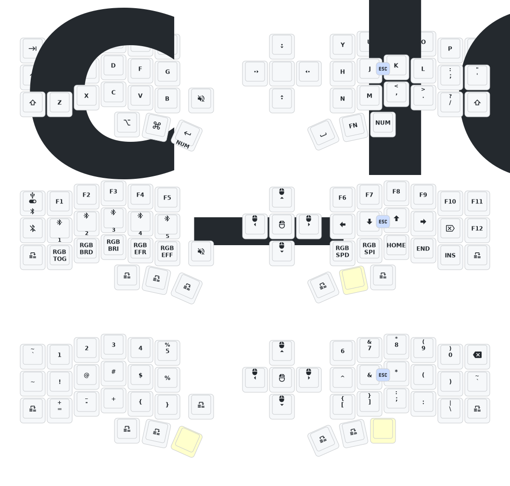

## Hướng dẫn

1.  [Fork repository](https://docs.github.com/en/get-started/quickstart/fork-a-repo#forking-a-repository).
2.  [Nhấp vào tab **Actions** và đảm bảo workflow đã được bật](https://docs.github.com/en/actions/managing-workflow-runs-and-deployments/managing-workflow-runs/disabling-and-enabling-a-workflow#enabling-a-workflow).
3.  Nếu vẫn còn thư mục `boards/arm/eyelash_corne` trong bản fork của bạn, hãy xóa nó đi.
4.  [Chỉnh sửa keymap online đơn giản](https://nickcoutsos.github.io/keymap-editor/).

## Sơ đồ Keymap

